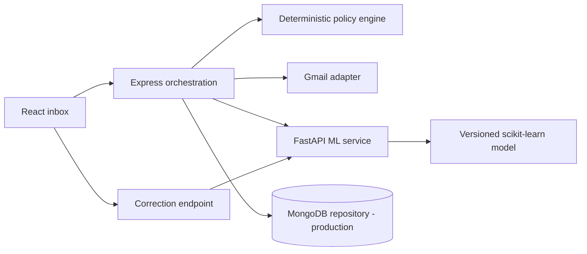

# InboxPilot: Complete Learning Guide

## 1. What this project teaches

InboxPilot is deliberately more than a classifier. Its important engineering idea is the separation between **what an email is** and **what the system is allowed to do**. A model can say that a message resembles noise with 96% confidence, but a policy engine still decides whether archiving is safe. This makes autonomy a configurable, testable product policy instead of an unexplained model side effect.

The project is intentionally dual-mode: demo mode uses a mock Gmail adapter and memory, while production mode uses Gmail OAuth, MongoDB/Mongoose persistence, the FastAPI ML service, and a versioned scikit-learn champion artifact. Neither mode sends a reply automatically; sensitive content is escalated.

## 2. Architecture

The React/Vite web application is the presentation layer. It shows the queue, confidence, reasons, activity feed, drafts, corrections, and settings. Express is the user-facing orchestration service. It owns validation, the policy engine, the Gmail adapter boundary, action state, and the REST contract. FastAPI is the ML boundary: it exposes classification, drafting, and correction intake. The intended production persistence boundary is MongoDB, while the demo repository is an in-memory map.

A request follows: `sync → normalize → classify → decide → apply or skip → audit → user correction`. The policy engine is independently testable because it receives plain values rather than calling a model itself.

## 3. The policy decision

The initial taxonomy is `noise`, `routine`, `important`, `high_stakes`, and `unknown`. A high-stakes regular expression is a safety backstop for terms such as security, payment, password, medical, legal, and verification. A matching message is escalated and left untouched. Otherwise, high-confidence noise can be archived if the user enabled auto-archive, and high-confidence routine mail gets a reviewable draft. Everything else produces no autonomous mutation.

The default archive threshold is 90%; the draft threshold is 72%. A user can change these settings. Crucially, changing thresholds does not retrain the model: it changes the decision policy only. This is a good example of separating statistical uncertainty from product risk tolerance.

## 4. API and code organization

`apps/api/src/server.ts` defines the REST surface and demo orchestration. `apps/api/src/gmail.ts` contains the provider boundary. A real Gmail implementation can replace `MockGmailAdapter` while preserving the routes and tests. `apps/api/src/policy.ts` contains the decision function, defaults, safety override, reason codes, and undo availability.

The core routes are `/api/sync`, `/api/decisions`, `/api/decisions/:id/undo`, `/api/decisions/:id/correction`, `/api/decisions/:id/approve-draft`, and `/api/settings`. `/api/health` is designed for Render health checks. All mutating demo operations are explicit POST/PUT routes; a production implementation should add authenticated ownership checks, request IDs, idempotency keys, and persistence transactions.

## 5. ML lifecycle

The ML service in `services/ml/app/main.py` provides the contract, while `services/ml/train.py` now trains a versioned hybrid champion artifact from 125 curated examples across five classes. The model combines word-level TF-IDF, character-level TF-IDF, transparent intent-marker features, balanced logistic regression, and sigmoid calibration. Five-fold stratified cross-validation reports 74.4% accuracy, 73.8% macro-F1, and 74.4% balanced accuracy. The service loads that artifact when present and falls back to a conservative heuristic if the artifact is unavailable. The fit score is intentionally not presented as the quality claim because it is optimistic; cross-validation is the relevant estimate. A real mailbox rollout should add reviewed mailbox labels, sender-aware or time-aware splits, action-coverage curves, and safety gates.

Corrections are valuable because they represent the user’s actual mailbox preferences. They should not immediately replace the champion model. Instead, deduplicate corrections, add them to an offline candidate dataset, train a challenger, compare it against a fixed holdout and safety suite, and promote only if minimum quality and high-stakes recall gates pass. Keep the old model artifact for rollback. This is the active-learning loop: user feedback creates new labeled data, but promotion remains controlled.

## 6. Drafting and RAG boundaries

The current demo draft is deterministic and clearly marked as not sent. A production RAG implementation should retrieve only a small number of relevant, redacted past sent-email examples, include their IDs for traceability, and bound the context length. Email text is untrusted input: it can contain prompt injection. The system prompt must say that email content is data, not instructions. The model output should be a suggested draft with no automatic send capability, and the UI should expose the grounding references.

If an LLM is unavailable, a template fallback is preferable to a broken or fabricated response. The draft route should reject unsupported claims, preserve uncertainty, and impose output length limits.

## 7. Gmail integration plan

Create a Google Cloud project and configure an OAuth consent screen. Use least-privilege Gmail scopes, store encrypted refresh tokens, validate OAuth state to prevent CSRF, and register the exact production callback URL. Use Gmail history IDs for incremental sync and bounded pagination for the first sync. Treat Gmail operations as at-least-once: use idempotency keys, record the intended mutation, retry transient failures with backoff, and reconcile after partial failures.

Archiving should remove the inbox label, not delete the message. Undo should restore the label only if the message still matches the recorded precondition. Draft approval should save a draft but never send. Unsubscribe support should prefer standards-compliant `List-Unsubscribe` mechanisms, allow dry-run previews, require HTTPS/domain safety checks, and leave unsupported senders untouched.

## 8. Privacy and security

Do not retain complete email bodies by default. Store normalized metadata, short-lived processing text, hashes, and redacted snippets under an explicit retention policy. Never log tokens, message bodies, or model prompts containing private content. Add user disconnect and deletion flows and explain that deleting InboxPilot metadata cannot delete Gmail data unless the user explicitly authorizes that operation.

Production hardening includes secure cookies, CSRF/state checks, authorization on every resource, input schemas, SSRF-safe outbound requests, rate limits, dependency auditing, safe errors, and secret scanning. The demo has a small CORS surface and payload limits; it is not a substitute for production identity or encrypted token storage.

## 9. Testing strategy

Node tests cover the policy invariants: noise can archive, routine can draft, high-stakes content escalates even at high confidence, and low confidence does nothing. Python tests cover health, high-stakes classification, and the draft safety note. The frontend production build is a type-check and bundling gate.

The next CI layer should add contract tests against JSON schemas, an ephemeral MongoDB integration suite, React interaction tests, SSRF/prompt-injection fixtures, and a mocked Gmail end-to-end test that syncs all four demo messages, verifies archive/draft/escalation decisions, performs undo, submits a correction, and verifies the activity feed.

## 10. Performance

Measure first. Useful baselines are frontend LCP/INP/CLS, API p50/p95 latency, classification latency, sync throughput, bundle size, and database query timings. Paginate decisions, index queries by user and received time, avoid per-email model/network calls when batching is safe, cap Gmail pages, and use bounded concurrency. Do not add Redis or broad caching until measurements show a bottleneck; per-user inbox state must never be served from an incorrectly keyed cache.

## 11. Deployment on Render, Vercel, and Atlas

The provided `render.yaml` defines separate API, ML, and static web services. Deploy ML and API first. Set the API’s `WEB_ORIGIN`, `ML_SERVICE_URL`, and generated `SESSION_SECRET`. Deploy the frontend with `VITE_API_URL=https://your-api.onrender.com/api`. For production, add MongoDB Atlas and change the repository implementation from the demo map to Mongoose models with indexes.

For Gmail, set Google client credentials in the API service, add the exact Render callback URL to Google Cloud, and complete the consent screen. Validate `/api/health`, `/health`, the frontend API URL, CORS, and a dedicated Gmail smoke test. Render free services may sleep; use explicit user-triggered sync for a free demo or a paid worker for predictable polling.

## 12. Interview-level design discussion

The strongest design discussion is the autonomy/caution boundary. A static classifier only answers “what category is this?” InboxPilot answers a second question: “given confidence, content risk, sender context, and user settings, what is safe to do?” The system records reasons and model versions so a user can understand and correct it. Online learning closes the loop, while champion/challenger promotion prevents one bad correction from silently changing behavior. That combination demonstrates practical ML engineering, safety-aware agent design, and full-stack product judgment.

## 13. Current limitations and next steps

The delivered release includes the Gmail OAuth/API adapter, MongoDB schemas and indexes, ML-service integration with timeout/fallback, reproducible champion training, and the credential-free demo. Before public release, configure authenticated sessions, encrypt refresh-token storage, complete Google OAuth verification, add live unsubscribe review, expand the dataset, add candidate-model promotion gates, and run a dedicated test mailbox. Keep demo mode as a safe onboarding path and regression fixture.
